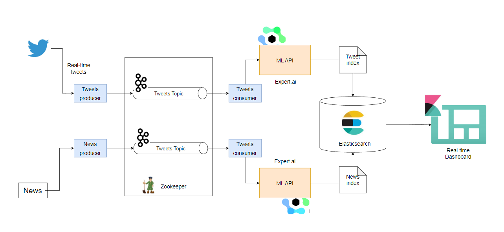

# SENCE-MEDIA
A real-time analytics program for detection of Hate speech on social media and analysing sentiments of news media articles.

**Table of Contents**
- [SENCE-MEDIA](#sence-media)
  - [The Goal](#the-goal)
  - [Project Architechture](#project-architechture)
  - [Services](#services)
  - [Tools used](#tools-used)
  - [APIS](#apis)

---

## The Goal
The idea is to detect hate-speech against individual, community, organization, company on social media and use the data for a better visual representation for analytics. 

Along with hate-speech, the project also focuses on sentiment analysis of news media articles about any of the above mentioned entity and present the resultant data in a dashboard.

**Dashboard Demo**

Since, it is a real-time pipeline, the data producer services run every day and the dashboard refreshes every 10 sec.

---

## Project Architechture

- **Data Producers** : There are 2 producers, one producing *Tweets* and the other one that is responsible for sending *news articles*. The producer services send the messages via a Kafka topic.
- **Data Consumers** : Like producers, there are 2 consumers. One for *tweets* and another for *news articles*. On the consumer, the **Expert.ai** NLP API is called for classification and speech detection of the received messages. The classified data is then sent to the Elasticsearch indexes, that is used by Kibana for dashboarding.
- **Apache Kafka** : Has two topics, "topic-1" and "topic-2", each with 2 partition and 2 replicas. 
- **Elasticsearch & Kibana** : Two separate indexes for storing news articles and tweets. Kibana access the data for visualization.

---

## Services
- **Producer** : The producer services are named as [send_news](send_news/) and [send_tweets](send_tweets/).
- **Consumer** : The consumer services are put as seperate services, name [receive_news](receive_news/) and [receive_tweets](receive_tweets/).

---

## Tools used
- fastAPI
- Apache Kafka
- Elasticsearch
- Kibana
- Docker

---

## APIS
- [Twitter V2 API](https://www.tweepy.org/)
- [NewsAPI](https://newsapi.org/)
- [Expert.ai](https://www.expert.ai/)

